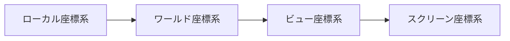

# [advanced/mapping.md]

# マッピング

## 資料
[Neoforge - What are Mappings](https://neoforged.net/personal/sciwhiz12/what-are-mappings/)

[SpongePowered - MCP](https://docs.spongepowered.org/stable/en/plugin/internals/mcp.html)

[マッピング - FabricMC](https://wiki.fabricmc.net/ja:tutorial:mappings)

## 難読化とマッピング
Minecraft（Java版）のjarファイルは**難読化**されており、クラス名やメソッド名などが読解困難な名前になっています。

これらを開発者が理解できる名前に変換するための対応表を**マッピング**と呼びます。

Forgeでは、本番環境ではSRGマッピング、開発環境では指定したマッピングを使用します。

このマッピングの違いにより、Mixinなどの低レイヤー機能が開発環境と本番環境で異なる動作をすることがあります。

そのため開発環境だけでなく、ビルドしたjarファイルでの本番環境テストも必須です。

## SRG

バージョン間で名前が変わってしまうため、共通化するのが目的の中間マッピングです。

`m_286052_`や`f_90981_`等のように表記されます。

## マッピングの種類(Forge)

### MCP (Mod Coder Pack)
古くから使われているコミュニティ主導のマッピングです。SRG名を経由する仕組みが特徴です。

Forge等は内部処理でSRG名を使用しているため、エラーログ等で見かけることがあります。

### Official Mappings (Mojang Mappings)
Mojang公式のマッピングです。現在のMOD開発の主流ですが、引数名やローカル変数名までは復元されません。

### Parchment
Official Mappingsを拡張し、**引数名やローカル変数名を読みやすくした**マッピングです。

Official Mappingsと互換性があるため、開発の途中から導入しても基本的に問題ありません。

## Parchmentの導入方法(1.20.1)

1. プロジェクト直下の `settings.gradle` に以下の maven リポジトリを追加します。
    ```diff title="settings.gradle"
    pluginManagement {
        repositories {
    +       maven { url = 'https://maven.parchmentmc.org' }
        }
    }
    ```
2. `build.gradle` でプラグインを適用します。
    ```diff title="build.gradle"
    plugins {
        id 'net.minecraftforge.gradle' version '[6.0.16,6.2)'
    +   id 'org.parchmentmc.librarian.forgegradle' version '1.+'
    }
    ```

    !!! warning
        必ず `net.minecraftforge.gradle` の下に追加してください。

3. マッピング設定を変更します。
```diff title="build.gradle"
minecraft {
-    mappings channel: 'official', version: '1.20.1'
+    mappings channel: 'parchment', version: '2023.09.03-1.20.1'
}
```
`mapping_channel` などと変数で指定されている場合は、`gradle.properties` から編集してください。

!!! note "バージョンの指定について"

    上記は1.20.1の例（`2023.09.03-1.20.1`）です。
    [ParchmentMC 公式サイト](https://parchmentmc.org) や [Mavenブラウザ](https://ldtteam.jfrog.io/ui/native/parchmentmc-public/org/parchmentmc/data/) で、使用しているMinecraftバージョンに対応するParchmentバージョンを確認して設定してください。

4. Gradleの更新
    設定を変更したら、Gradleプロジェクトをリフレッシュ、もしくは同期してください。IDE上で変更が反映されるはずです。

## Parchmentの導入方法(Neoforge)

以下を参照してください。

https://docs.neoforged.net/toolchain/docs/parchment/


# [getting-started/dependency.md]

# 依存関係

他の Mod やライブラリをプロジェクトに読み込むための設定は `build.gradle` の `dependencies` ブロックで行います。

## 依存関係の構成

Gradle では依存関係を `dependencies` ブロックで指定します。

指定の方法はいくつかあります。

| 構成 | 説明 | 用途の例 |
| :--- | :--- | :--- |
| `implementation` | コンパイル時と実行時の両方で依存関係を必要 | 必須の前提 Mod、常時使用するライブラリ |
| `compileOnly` | コンパイル時にのみ必要 | コンパイルにだけ必要な API、注釈プロセッサ |
| `runtimeOnly` | コンパイル時には不要、実行時にのみ必要 | 連携確認用の Mod（JEI など）、コンパイルコードには触れないが動作確認に必要な Mod |
| `annotationProcessor` | コンパイル時の注釈処理に使用される | Mixin などのプロセッサ |

## マッピングについて

Minecraft の Mod は通常、難読化されています。

開発環境でこれらを扱うために、ForgeGradle は `fg.deobf` という特別なメソッドを提供しています。

これを依存関係の宣言時に噛ませることで、指定した Jar ファイルを開発環境のマッピングに合わせて再マッピングして読み込んでくれます。

```gradle title="build.gradle"
dependencies {
    // JEI
    implementation fg.deobf("curse.maven:jei-238222:4712866")
}
```

## Mod の依存関係を追加する

### CurseMaven を使用する

[CurseMaven](https://www.cursemaven.com/) は、CurseForge 上のファイルを Maven 依存関係として簡単に扱えるようにする非公式サービスです。

1.  **リポジトリの追加**

    `repositories` ブロックに以下を追加します。
    ```gradle
    repositories {
        maven {
            url "https://cursemaven.com"
            content {
                includeGroup "curse.maven"
            }
        }
    }
    ```
    !!! info

        content指定はなくても良いですが、Cursemavenへの無駄なリクエストを減らすことができます。

3.  **依存関係の記述**
    フォーマット: `curse.maven:<description>-<projectID>:<fileID>`
    *   **description**: 任意の識別用文字列（実際の解決には使われません）
    *   **projectID**: CurseForge プロジェクト ID (About Project 欄などに記載)
    *   **fileID**: `Files` タブで特定のファイルを開いた際の URL 末尾の数字

    ```gradle
    dependencies {
        // JEI の例 (Project ID: 238222, File ID: 4712866)
        compileOnly fg.deobf("curse.maven:jei-238222:4712866")
        runtimeOnly fg.deobf("curse.maven:jei-238222:4712866")
    }
    ```

    以上のように記述できますが、手間がかかります。

    Curseforgeでファイルを開くと、`Curse Maven Snippet`という欄に依存関係として使用する記述があります。(例: [JEI](https://www.curseforge.com/minecraft/mc-mods/jei/files/7391695))

    これをそのままコピーすると楽です。

### Modrinth Maven を使用する

Modrinth も公式で Maven リポジトリを提供しています。([Modrinth Maven](https://support.modrinth.com/en/articles/8801191-modrinth-maven))

1.  **リポジトリの追加**
    
    ```gradle
    repositories {
        exclusiveContent {
            forRepository {
                maven {
                    name = "Modrinth"
                    url = "https://api.modrinth.com/maven"
                }
            }
            forRepositories(fg.repository) // Only add this if you're using ForgeGradle, otherwise remove this line
            filter {
                includeGroup "maven.modrinth"
            }
        }
    }
    ```

2.  **依存関係の記述**
    
    フォーマット: `maven.modrinth:<projectID>:<version>`

    * ProjectID: プロジェクトのID。URLにある。
    * Version: バージョン、ファイルを開いて`Version number`の欄にある

    例: [JEI](https://modrinth.com/mod/jei/version/p7yZWpEg)

    ```gradle
    dependencies {
        implementation fg.deobf("maven.modrinth:jei:15.20.0.129")
    }
    ```

### ローカルの Jar ファイルを使用する

Maven リポジトリに公開されていない Mod を開発環境に入れたい場合などは、プロジェクト内のフォルダから読み込むこともできます。

1.  プロジェクトルートに `libs` フォルダを作成し、そこに `.jar` ファイルを入れます。

2.  リポジトリの設定

    ```gradle
    repositories {
        flatDir {
            dirs "libs"
        }
    }
    ```
3.  `dependencies` に以下のように記述します。

    `group:name:version`の形式である必要があります。
    `group`は何でも良いので、ここでは`blank`としています。
    
    ファイル名は `name-version.jar` の形式になっている必要があります。

    ```gradle
    dependencies {
        // libs/jei-1.20.1-forge-15.20.0.129.jar
        implementation fg.deobf("blank:jei-1.20.1-forge:15.20.0.129")
    }
    ```

# [rendering/api.md]

# レンダリングAPI

## 座標変換と回転行列

### PoseStack

座標変換(移動・回転・拡大縮小)を管理するスタックです。

これによってプレイヤーの手に持った剣だけを回転させる、といったことが可能になります。

| メソッド名 | 説明 |
| --- | --- |
| `push` | 現在の状態(位置・回転)を保存する。ここから局所的な作業を始める合図。 |
| `translate` | 座標を移動する。 |
| `scale` | 座標を拡大縮小する。 |
| `rotate` | 座標を回転する。 |
| `pop` | 保存した状態に戻す。作業終了。 |

!!! warning

    `push` と `pop` は必ずセットで行ってください。

### Quaternion

回転を表す数学的概念。

`Axis.YP.rotationDegrees(90)` のように軸を指定して `Quaternion` を作成し、`PoseStack` に適用できます。

```java
// Y軸中心に+90度回転します
poseStack.mulPose(Axis.YP.rotationDegrees(90));
// Y軸中心に-90度回転します
poseStack.mulPose(Axis.Y.rotationDegrees(90));
```

## 描画バッファ

### MultiBufferSource(BufferSource)

VertexConsumer を RenderType ごとに振り分け、結果的にバッチレンダリングを行うためのクラスです。

複数の描画をまとめて処理できるため、レンダリング効率が向上します。

`MultiBufferSource#getBuffer(RenderType)` を呼び出すことで、指定した RenderType に対応する VertexConsumer を取得できます。

異なる RenderType が渡された場合、それまでのバッチは `endBatch` によって終了され、その時点で描画が実行されます。

!!! warning

    バッチが終了したタイミングで描画されるため、`endBatch` が呼ばれない限り描画されません。(GuiGraphics等は自動で`endBatch`を呼ぶ)

### Tesselator

即時レンダリング用のクラス。

`MultiBufferSource` とは異なり、自動的にバッチレンダリングはされない。

`Tesselator.getInstance()` で取得し、
`.getBuilder(RenderType)` で `VertexConsumer` を取得する。

`.end` で明示的に描画します。

### VertexConsumer(BufferBuilder)

基本的な描画は `VertexConsumer` というインターフェースを通して頂点を登録します。

頂点は以下の値を持ちます。

`RenderType` で指定されている `VertexFormat` によって必要な変数が異なります

[#VertexFormat](./render-options.md#vertexformat) を参照

!!! warning

    `VertexFormat` で指定されている順番通りに `VertexConsumer` に頂点情報を渡す必要があります。

!!! danger

    必要な変数を設定しない場合クラッシュします。

| 変数名 | 説明 |
| --- | --- |
| `x` | X座標 |
| `y` | Y座標 |
| `z` | Z座標 |
| `red` | 赤成分 |
| `green` | 緑成分 |
| `blue` | 青成分 |
| `alpha` | 透明度(float0.0~1.0, int0~255) |
| `texU` | テクスチャ座標(U) |
| `texV` | テクスチャ座標(V) |
| `overlayUV` | オーバーレイUV座標(被ダメージ時の赤色等)(パック済み) |
| `lightmapUV` | ライトマップUV |
| `normalX` | 法線ベクトルX |
| `normalY` | 法線ベクトルY |
| `normalZ` | 法線ベクトルZ |

!!! info

    線は特殊で、視点から終点へ向かう方向を表すベクトルとして設定する必要があります。

```java
public static void drawHorizontalQuad(
        PoseStack poseStack,
        MultiBufferSource buffer,
        float x0, float y, float z0,
        float width, float depth,
        float u, float v,
        int r, int g, int b, int a
) {
    Matrix4f matrix4f = poseStack.last().pose();

    // 単色
    VertexConsumer consumer = buffer.getBuffer(RenderType.lightning());

    float x1 = x0 + width;
    float z1 = z0 + depth;

    consumer.vertex(matrix4f, x0, y, z0)
            .color(r, g, b, a)
            .endVertex();

    consumer.vertex(matrix4f, x1, y, z0)
            .color(r, g, b, a)
            .endVertex();
    
    consumer.vertex(matrix4f, x1, y, z1)
            .color(r, g, b, a)
            .endVertex();

    consumer.vertex(matrix4f, x0, y, z1)
            .color(r, g, b, a)
            .endVertex();
}

// 線の描画
public static void drawLine(
        PoseStack poseStack,
        MultiBufferSource buffer,
        float x1, float y1, float z1,
        float x2, float y2, float z2,
        int r, int g, int b, int a
) {
    Matrix4f matrix4f = poseStack.last().pose();
    Matrix3f matrix3f = poseStack.last().normal();

    VertexConsumer consumer = buffer.getBuffer(RenderType.lines());

    float dx = x2 - x1;
    float dy = y2 - y1;
    float dz = z2 - z1;

    consumer.vertex(matrix4f, x1, y1, z1)
            .color(r, g, b, a)
            .normal(matrix3f, dx, dy, dz)
            .endVertex();

    consumer.vertex(matrix4f, x2, y2, z2)
            .color(r, g, b, a)
            .normal(matrix3f, dx, dy, dz)
            .endVertex();
}
```

## テクスチャアトラス

### 資料

- [Minecraft Wiki](https://ja.minecraft.wiki/w/テクスチャ#テクスチャアトラス)

OpenGLではテクスチャを切り替える(Bind)処理は比較的重い処理です。

そのため、Minecraftでは大量のブロックやアイテムのテクスチャを**1枚の巨大な画像**にまとめて扱うことで、描画時の切り替えコストを削減しています。

このまとめられた1枚の画像を**テクスチャアトラス**と呼びます。

!!! tips

    エンティティのテクスチャはテクスチャアトラスを使用していません。

### 種類

以下の静的なテクスチャアトラスが存在します。

| 参照 | ID | ディレクトリ | 説明 |
| --- | --- | --- | --- |
| `Sheets.BANNER_SHEET` | banner_patterns | entity/banner_base, entity/banner/\* | バナー |
| `Sheets.BED_SHEET` | beds | entity/bed/\* | ベッド |
| `Sheets.CHEST_SHEET` | chests | entity/chest/\* | チェスト |
| `Sheets.SHIELD_SHEET` | shield_patterns | entity/shield_base, entity/shield_base_nopattern, entity/shield/\* | シールド |
| `Sheets.SIGN_SHEET` | signs | entity/signs/\* | 看板 |
| `Sheets.SHULKER_SHEET` | shulker_boxes | entity/shulker/\* | シャーカーボックス |
| `Sheets.ARMOR_TRIMS_SHEET` | armor_trims | 特殊[^1] | アーマートリム |
| `Sheets.DECORATED_POT_SHEET` | decorated_pot | entity/decorated_pot/\* | 飾り壺 |
| `TextureAtlas.LOCATION_BLOCKS` | blocks | block/\*, item/\*, entity/conduit, ... | ブロック |
| `TextureAtlas.LOCATION_PARTICLES` | particles | particle/\* | パーティクル |
| `textures/atlas/paintings.png` | paintings | painting/\* | 絵画 |
| `textures/atlas/mob_effects.png` | mob_effects | mob_effect/\* | モブエフェクト |

比較的汎用に使えるのは `TextureAtlas.LOCATION_BLOCKS` です。

[^2]: `paletted_permutations` を使用している。`PalettedPermutations` を参照。

## RenderType

[#RenderType](./render-options.md#rendertype) で解説しています。

# [rendering/basic.md]

# レンダリング (1.20.1)

<!-- NOTE: Minecraftに限らない知識 -->

解説する必要のある事柄が多すぎるため、レンダリングするうえでの最小限の知識を解説しています。

## 技術スタック

### GPU

GPUで描画されている。

### OpenGL

グラフィックスドライバと通信するための規格。

ステートマシンとなっているため、設定した値は戻すまで状態が維持されます。

そこでバニラのメソッドはうまくラッピングし、カバーしています。

### LWJGL

MinecraftはLWJGLというライブラリを経由してOpenGLで描画しています。

基本的にはOpenGLのコマンドを直接叩くことは少なく、用意されたAPIを通して描画します。

### Blaze3D

MinecraftがOpenGLを直接叩く代わりに用意した静的クラス群。

Mod制作では、GLコマンドを直接叩くのではなく、用意されたAPI(RenderSystem等)を通して描画します。

### JOML

数学ライブラリとしては主にJOMLが使用されています。

## 座標系

座標系は大きく3つあり、それぞれ異なる用途を持っています。
(Minecraftにおいて明確に定義されているわけではない)

それらの座標系は主に `PoseStack` によって操作、管理されています。
([レンダリングAPI](./api.md#posestack)で解説)

様々な座標系がありますが、結果的にはスクリーン座標系に変換され描画されます。

### ワールド座標系

ゲーム内のブロックやエンティティが存在する絶対的な座標。

ゲーム内で通常使うXYZ座標がこれにあたります。

**軸**

- X+: 東 (East)
- Y+: 上 (Up)
- Z+: 南 (South)

### ビュー座標系

カメラを中心とした座標系。

### スクリーン座標系

インベントリ画面やHUD(ホットバー、体力等)を描画する際の2D座標。

**原点(0,0)**: 画面の左上隅。

**軸**

- X+ 右へ
- Y+ 下へ (ワールド座標とYの向きが逆なので注意！)
- Z+: 奥(深度+)

### ローカル座標系

個々のオブジェクトを中心とした相対的な座標系。

### 座標変換

基本的に以下の流れで座標変換されます。



## テクスチャ座標(UV)

モデルの頂点には、テクスチャのどの部分を貼り付けるかという情報(**UV**)を持たせます。

スクリーン座標系と同じ軸と原点を持っていて、U,Vどちらも範囲は0.0～1.0です。

- 開始位置: (u0, v0)
- 終了位置: (u1, v1)

を持ちます。

!!! info

    JSONモデルでは、UVはピクセル単位で指定しますが、シェーダーに送られる際には、テクスチャアトラス内での位置として変換されたUV値として扱われます。

## 描画方法

### 頂点

OpenGLにおいて、すべての物体は頂点の集まりによって構成されています。

頂点とは、3Dモデルを構成する最小単位の点のことです。

**主な値(Minecraftにおいて)**

- Position: 位置情報
- Color: 色情報
- UV: テクスチャ座標
- Normal(法線): 光の当たり方等を計算するために必要
- ライトマップ: 光のテクスチャ
- オーバーレイテクスチャ: ダメージ表現やTNTの点滅等に使われるテクスチャのUVの指定

## レンダリングパイプライン

### ラスタライズ

頂点で構成された図形を、フラグメントに変換する処理。

塗りつぶすピクセルごとに頂点の情報(色、UV、法線等)を線形補間して割り当てます。

### フラグメント(Fragment)

ピクセルになる前の計算途中のデータです。

ピクセル座標、深度値、テクスチャ座標等、線形補間されたデータを持ちます。

### Fragment Shader

フラグメントシェーダーは、フラグメントの情報を元に、最終的な色を決定するシェーダープログラムです。

つまり、描画する色を決定するシェーダープログラムです。

例

```glsl title="position_color.fsh"
#version 150

in vec4 vertexColor;

uniform vec4 ColorModulator;

out vec4 fragColor;

void main() {
    vec4 color = vertexColor;
    if (color.a == 0.0) {
        discard;
    }
    fragColor = color * ColorModulator;
}
```

### Vertex Shader

頂点シェーダーは、頂点の情報を元に、最終的な位置を決定するシェーダープログラムです。

例

```glsl title="position_color.vsh"
#version 150

in vec3 Position;
in vec4 Color;

uniform mat4 ModelViewMat;
uniform mat4 ProjMat;

out vec4 vertexColor;

void main() {
    gl_Position = ProjMat * ModelViewMat * vec4(Position, 1.0);

    vertexColor = Color;
}
```

# [rendering/render-options.md]

# 描画設定

## RenderType

描画についての設定。

半透明処理や深度テストの挙動を決めます。

`RenderType` 内に定数として存在します。

詳しくはクラスを参照してください。

### RenderTypeでよく使われる用語

| RenderType | 説明 | 備考 |
| --- | --- | ---- |
| `solid` | 不透明 |
| `cutout` | 切り抜き | アルファ値が閾値(通常0.1)を下回るピクセルを破棄し、それ以外を不透明として描画する |
| `mipped` | ミップマップ | 距離に応じてテクスチャ解像度を下げる。遠景のノイズを防ぐ |
| `translucent` | 半透明 | 深度書き込みは無効 |
| `entity` | テクスチャやテクスチャアトラスを指定できる |
| `text` | テキスト | GUIやネームタグのテキスト描画用 |
| `lines` | 線 |
| `gui` | GUI |

### 独自RenderTypeの作成

バニラのRenderTypeに必要な設定がない場合作成します。

**RenderType.create**

- `VertexFormat`: 頂点フォーマット。大体 `DefaultVertexFormat` から指定
- `VertexFormat.Mode`: 頂点モード
- `bufferSize`: レンダリングバッファサイズ。頻度や内容によるが小規模なら256で十分
- `RenderType.CompositeState`: `CompositeStateBuilder#createCompositeState` でビルドし渡す

**CompositeStateBuilder**

`RenderType.CompositeState.builder()` で作成する。

- `setTextureState`: [テクスチャアトラス](./api.md#テクスチャアトラス)の指定
- `setShaderState`: シェーダーの指定
- `setTransparencyState`: 半透明の処理方法([#ブレンドモード](#ブレンドモード))の指定
- `setDepthTestState`: 深度テストの指定
- `setCullState`: カリングの指定(`CULL`：背面を描画しない)
- `setLightmapState`: [ライトマップ](#ライトマップ)の適用の有無
- `setOverlayState`: [オーバーレイ](#オーバーレイテクスチャ)の適用の有無
- `setLayeringState`: レイヤリング(ポリゴンオフセットなど)の指定
- `setOutputState`: 出力先[レンダーターゲット](#レンダーターゲット)の指定
- `setTexturingState`: テクスチャの準備の指定
- `setWriteMaskState`: 書き込むバッファのマスク設定(カラーバッファや深度バッファ)
- `setLineState`: 線の太さを指定
- `setColorLogicState`: 色調整ののモードを指定
- `createCompositeState`: 設定をビルドする

バニラのRenderTypeの例

```java
// RenderType.SOLID
private static final RenderType SOLID = RenderType.create(
    "solid",
    DefaultVertexFormat.BLOCK,
    VertexFormat.Mode.QUADS,
    2097152,
    true,
    false,
    RenderType.CompositeState.builder()
        .setLightmapState(LIGHTMAP)
        .setShaderState(RENDERTYPE_SOLID_SHADER)
        .setTextureState(BLOCK_SHEET_MIPPED)
        .createCompositeState(true)
```

## VertexFormat

GPUに送る情報のレイアウトを決定するためのフォーマット。

各要素は Vertex Shader の `attribute` 変数に対応します。

基本、`DefaultVertexFormat`から取得します。

!!! warning

    `VertexFormat` で指定されている順番通りに `VertexConsumer` に頂点情報を渡す必要があります。

**DefaultVertexFormat** の定数

| 名前 | 1 | 2 | 3 | 4 | 5 | 6 | 7 |
| --- | --- | --- | --- | --- | --- | --- | --- |
| `BLIT_SCREEN` | Position | UV | Color |
| `BLOCK` | Position | Color | UV0 | UV2 | Normal | Padding |
| `NEW_ENTITY` | Position | Color | UV0 | UV1 | UV2 | Normal | Padding |
| `PARTICLE` | Position | UV0 | Color | UV2 |
| `POSITION` | Position |
| `POSITION_COLOR` | Position | Color |
| `POSITION_COLOR_NORMAL` | Position | Color | Normal | Padding |
| `POSITION_COLOR_LIGHTMAP` | Position | Color | UV2 |
| `POSITION_TEX` | Position | UV0 |
| `POSITION_COLOR_TEX` | Position | Color | UV0 |
| `POSITION_TEX_COLOR` | Position | UV0 | Color |
| `POSITION_COLOR_TEX_LIGHTMAP` | Position | Color | UV0 | UV2 |
| `POSITION_TEX_LIGHTMAP_COLOR` | Position | UV0 | UV2 | Color |
| `POSITION_TEX_COLOR_NORMAL` | Position | UV0 | Color | Normal | Padding |

`"UV0"` と `"UV"` は同値である。

**VertexFormatの要素**

| 名前 | 説明 | 対応するメソッド(VertexConsumer) |
| --- | --- | --- |
| Position | 頂点座標 | `vertex(x, y, z)` |
| Color | 色 | `color(r, g, b, a)` |
| UV0 | テクスチャUV | `uv(u, v)` |
| UV1 | オーバーレイUV | `overlayCoords(u, v)` |
| UV2 | ライトマップUV | `uv2(u, v)` |
| Normal | 法線 | `normal(x, y, z)` |
| Padding | 余白 |

## ブレンドモード

ブレンドモードとは、透明度によってどのように描画色を決定するかの設定の事です。

`RenderStateShard` の中の定数としていくつか存在する。

- `src`: ソースのRGB色(描画対象)
- `src.a`: ソースの透明度
- `dst`: デスティネーションのRGB色(既に描画されている色)
- `dst.a`: デスティネーションの透明度

| 名称 | 説明 | 式 | 備考 |
| --- | ---- | ---- | --- |
| `NO_TRANSPARENCY` | 不透明 |
| `ADDITIVE_TRANSPARENCY` | 加算合成 | `src + dst` | alpha無視 |
| `LIGHTNING_TRANSPARENCY` | 発光合成 | `src * src.a + dst` |
| `GLINT_TRANSPARENCY` | エンチャントの輝き | `rgb = src * src.a + dst, a = dst.a` |
| `CRUMBLING_TRANSPARENCY` | 破壊表現の合成 | `rgb = 2 * src * dst, a = src.a` |
| `TRANSLUCENT_TRANSPARENCY` | 半透明合成 | `rgb = src * src.a + dst * (1 - src.a), a = src.a + dst.a * (1 - src.a)` |

## 深度

奥行きのこと。
描画順にかかわらず、奥のオブジェクトが手前のオブジェクトに常に隠れるようにするために存在する。

**深度バッファ**というものが存在し、各ピクセルに深度が保存されています。

### 深度テスト

深度値と既存の深度バッファ内の値を比較し、判定をパスしたピクセルのみを書き込むことで、前後関係を再現するためのもの。

#### 比較関数

| 名称 | 説明 |
| --- | --- |
| `NO_DEPTH_TEST` | 深度テストを行わない |
| `EQUAL_DEPTH_TEST` | 深度値が対象と等しい場合のみ描画 |
| `LEQUAL_DEPTH_TEST`(既定値) | 深度値が対象以下の場合のみ描画 |
| `GREATER_DEPTH_TEST` | 深度値が対象より大きい場合のみ描画 |

## カリング

裏面を描画するかどうか。

- `CULL`: 裏面を描画しない
- `NO_CULL`: 裏面を描画する

## ライトマップ

ブロックライト(U)とスカイライト(V)を組み合わせた結果の明るさの色をキャッシュした16x16のテクスチャ。

実際に頂点に格納するUVの値は圧縮されており、

その値は `LightTexture.pack(int blockLight, int skyLight)` で指定する値を取得できます。

## オーバーレイテクスチャ

汎用なオーバーレイ用の16x16のテクスチャ。

ライトマップと同じく頂点に格納するUVの値は圧縮されており、

`OverlayTexture.pack(int u, int v)` で指定する値を取得できます。

以下の用途で使われています。

- 負傷時/死亡時の赤色表示
- クリーパー点滅時の白色
- TNT点滅時の白色

## レイヤリング

Z-Fightingを回避するために使用されるオプション

| 名称 | 説明 |
| --- | --- |
| `NO_LAYERING` | レイヤリングを行わない |
| `POLYGON_OFFSET_LAYERING` | `glPolygonOffset` を使用し深度値を手前にずらす |
| `VIEW_OFFSET_Z_LAYERING` | `PoseStack` を微妙に内側にスケールする |

## レンダーターゲット

描画対象のバッファ。

大抵は最終的にmainレンダーターゲットに描画されます。

例えば半透明な描画の場合 `translucent` ターゲットに描画され、最終的に `main` レンダーターゲットに合成されます。

# [rendering/renderer/item.md]

# アイテムレンダラー

## 独自レンダラーを作成する

### レンダラークラスの作成

`BlockEntityWithoutLevelRenderer` の継承クラスを作る。

```java
class ExampleItemRenderer extends BlockEntityWithoutLevelRenderer {

    public ExampleItemRenderer(BlockEntityRenderDispatcher dispatcher, EntityModelSet modelSet) {
        super(dispatcher, modelSet);
    }

    @Override
    public void renderByItem(ItemStack itemStackIn, ItemDisplayContext type, PoseStack poseStack, MultiBufferSource bufferSource, int packedLight, int packedOverlay) {
        // レンダリング
    }
}
```


### Itemに登録

`Item#initializeClient` メソッドをオーバーライドし、
`consumer.accept` に `IClientItemExtensions` の実装を渡します。

例では匿名クラスを使用して登録しています。

```java
public class ExampleItem extends Item {
    public ExampleItem(Item.Properties properties) {
        super(properties);
    }

    @Override
    public void initializeClient(Consumer<IClientItemExtensions> consumer) {
        consumer.accept(
            new IClientItemExtensions() {
                private final BlockEntityWithoutLevelRenderer renderer = new ExampleItemRenderer(
                    Minecraft.getInstance().getBlockEntityRenderDispatcher(),
                    Minecraft.getInstance().getEntityModels()
                );

                @Override
                public BlockEntityWithoutLevelRenderer getCustomRenderer() {
                    return renderer;
                }
            }
        );
    }
}
```

### モデルの設定

[#builtin/entity](./model.md#builtinentity) を参照してください。

モデルの `"parent"` を `"builtin/entity"` に設定する必要があります。

```json
{
    "parent": "builtin/entity"
}
```

# [rendering/renderer/model.md]

# モデル

## ビルトイン `parent` モデル

モデルの `"parent"` に指定される、特別なモデル

### builtin/generated

アイテムのテクスチャに合ったモデルが `ItemModelGenerator` によって自動生成されます。

多くのフラットなアイテムはこれによって生成されています。

`item/generated` は `builtin/generated` を親モデルにしており、同じ効果が得られます。

### builtin/entity

`BuiltInModel` としてモデルが登録され、唯一 `IClientItemExtensions`の `getCustomRenderer` が適用されるモデルです。(`BakedModel#isCustomRenderer`が`true`)

その代わりに、モデルが一切描画されません。

## Forge モデルローダー

詳しくは [Custom Model Loader - Neoforge](https://docs.neoforged.net/docs/1.20.4/resources/client/models/modelloaders) を参照してください。

Neoforgeですがネームスペース以外は仕様がほとんど同じです。

| ID | 説明 |
| --- | --- |
| `forge:empty` | 何も描画されない |
| `forge:elements` | `elements`と`transform`で構成されるモデル |
| `forge:obj` | OBJモデルを読み込める。`.obj`と`.mtl`が必要 |
| `forge:fluid_container` | バケツやタンクなど、液体を含むモデル |
| `forge:composite` | 複数のモデルを組み合わせる |
| `forge:item_layers` | レイヤーの数が無制限で、レイヤーごとに `RenderType` を設定可能 |
| `forge:separate_transforms` | 視点によってモデルを変更できる |

## 独自モデルローダーの作成

実行時にモデルを生成して、ロードさせたり、アイテムによってモデルを変更するといったことができます。

以下２つの事が可能です。

### 1. モデル(Quad)を自動生成する

`IUnbakedGeometry#bake` を `SimpleUnbakedGeometry` が事前に定義してくれているため、`addQuads` によるQuadの登録をします。

```java
public class CubeModel extends SimpleUnbakedGeometry<CubeModel> {

    public static final IGeometryLoader<CubeModel> LOADER = CubeModel::deserialize;

    // 別クラスに移動しても良い
    public static CubeModel deserialize(JsonObject json, JsonDeserializationContext context) {
        float size = GsonHelper.getAsFloat(json, "size");

        return new CubeModel(size);
    }

    private final float size;

    public CubeModel(float size) {
        this.size = size;
    }

    @Override
    protected void addQuads(IGeometryBakingContext context, IModelBuilder<?> modelBuilder, ModelBaker modelBaker, Function<Material, TextureAtlasSprite> spriteGetter, ModelState modelState, ResourceLocation modelLocation) {

        List<BlockElement> blockElements = new ArrayList<>();

        Map<Direction, BlockElementFace> faces = new EnumMap<>(Direction.class);

        Material baseLocation = context.getMaterial("base");
        TextureAtlasSprite baseSprite = spriteGetter.apply(baseLocation);
        SpriteContents contents = baseSprite.contents();

        for (Direction face : Direction.values()) {
            faces.put(
                    face,
                    new BlockElementFace(null, -1, baseLocation.texture().toString(), new BlockFaceUV(
                            new float[]{0f, 0f, contents.width(), contents.height()}, 0
                    ))
            );
        }

        blockElements.add(new BlockElement(
                new Vector3f(8f - size, 8f - size, 8f - size),
                new Vector3f(8f + size, 8f + size, 8f + size),
                faces,
                null,
                false
        ));

        UnbakedGeometryHelper.bakeElements(modelBuilder, blockElements, spriteGetter, modelState, modelLocation);
    }
}
```

### 2. アイテムごとにモデルを変更する

`IUnbakedGeometry#bake` で `ItemOverrides` を入れ替えることによって実現できます。

`ItemOverrides#resolve` で動的にモデルを切り替えています。

キャッシュなどを使用し、Quad自動生成と組み合わせることで動的に自由にモデルを変更可能です。

例のJsonモデル:

```json
{
  "loader": "examplemod:example",
  "small": {
    "parent": "examplemod:item/example_small"
  },
  "large": {
    "parent": "examplemod:item/example_large"
  }
}
```

この例では
アイテムの個数が32以上の時、`item/example_large` になり、

32未満の場合 `item/example_small` になります。

```java
public class ExampleModel extends SimpleUnbakedGeometry<ExampleModel> {

    public static final IGeometryLoader<ExampleModel> LOADER = ExampleModel::deserialize;

    public final BlockModel smallModel;
    public final BlockModel largeModel;

    public ExampleModel(BlockModel smallModel, BlockModel largeModel) {
        this.smallModel = smallModel;
        this.largeModel = largeModel;
    }

    // 別クラスに移動しても良い
    public static ExampleModel deserialize(JsonObject json, JsonDeserializationContext context) {
        BlockModel smallModel = context.deserialize(GsonHelper.getAsJsonObject(json, "small"), BlockModel.class);
        BlockModel largeModel = context.deserialize(GsonHelper.getAsJsonObject(json, "large"), BlockModel.class);

        return new ExampleModel(smallModel, largeModel);
    }

    @Override
    public BakedModel bake(IGeometryBakingContext context, ModelBaker baker, Function<Material, TextureAtlasSprite> spriteGetter, ModelState modelState, ItemOverrides overrides, ResourceLocation modelLocation) {
        overrides = new ExampleOverrides();

        BakedModel bakedSmallModel = this.smallModel.bake(baker, this.smallModel, spriteGetter, modelState, modelLocation, context.useBlockLight());
        BakedModel bakedLargeModel = this.largeModel.bake(baker, this.largeModel, spriteGetter, modelState, modelLocation, context.useBlockLight());

        return new Baked(
                context.useAmbientOcclusion(),
                context.isGui3d(),
                context.useBlockLight(),
                spriteGetter.apply(context.getMaterial("particle")),
                overrides,
                bakedSmallModel,
                bakedLargeModel
        );
    }

    @Override
    public void resolveParents(Function<ResourceLocation, UnbakedModel> modelGetter, IGeometryBakingContext context) {
        this.smallModel.resolveParents(modelGetter);
        this.largeModel.resolveParents(modelGetter);
        super.resolveParents(modelGetter, context);
    }

    @Override
    protected void addQuads(IGeometryBakingContext iGeometryBakingContext, IModelBuilder<?> iModelBuilder, ModelBaker modelBaker, Function<Material, TextureAtlasSprite> function, net.minecraft.client.resources.model.ModelState modelState, ResourceLocation resourceLocation) {

    }

    public static class Baked implements IDynamicBakedModel {
        private final boolean isAmbientOcclusion;
        private final boolean isGui3d;
        private final boolean isSideLit;
        private final TextureAtlasSprite particle;
        private final ItemOverrides overrides;
        private final BakedModel smallModel;
        private final BakedModel largeModel;

        public Baked(boolean isAmbientOcclusion, boolean isGui3d, boolean isSideLit, TextureAtlasSprite particle, ItemOverrides overrides, BakedModel smallModel, BakedModel largeModel) {
            this.isAmbientOcclusion = isAmbientOcclusion;
            this.isGui3d = isGui3d;
            this.isSideLit = isSideLit;
            this.particle = particle;
            this.overrides = overrides;

            this.smallModel = smallModel;
            this.largeModel = largeModel;
        }

        public @NotNull List<BakedQuad> getQuads(@Nullable BlockState state, @Nullable Direction side, @NotNull RandomSource rand, @NotNull ModelData data, @Nullable RenderType renderType) {
            return smallModel.getQuads(state, side, rand, data, renderType);
        }

        @Override
        public boolean useAmbientOcclusion() {
            return this.isAmbientOcclusion;
        }

        @Override
        public boolean isGui3d() {
            return this.isGui3d;
        }

        @Override
        public boolean usesBlockLight() {
            return this.isSideLit;
        }

        @Override
        public boolean isCustomRenderer() {
            return false;
        }

        @Override
        public @NotNull TextureAtlasSprite getParticleIcon() {
            return this.particle;
        }

        @Override
        public @NotNull ItemOverrides getOverrides() {
            return overrides;
        }
    }

    public static class ExampleOverrides extends ItemOverrides {

        @Override
        public @Nullable BakedModel resolve(@NotNull BakedModel model, @NotNull ItemStack itemStack, @Nullable ClientLevel level, @Nullable LivingEntity livingEntity, int partialTicks) {
            int count = itemStack.getCount();

            if(model instanceof Baked baked) {
                return count >= 32 ? baked.largeModel : baked.smallModel;
            }
            return model;
        }
    }
```

### モデルローダーの登録

`ModelEvent.RegisterGeometryLoaders` イベントで登録します。

MODバスに登録してください。

```java
@Mod.EventBusSubscriber(modid = ExampleMod.MODID, value = Dist.CLIENT, bus = Mod.EventBusSubscriber.Bus.MOD)
public class ModelClientEvents {

    @SubscribeEvent
    public static void registerModelLoaders(ModelEvent.RegisterGeometryLoaders loaders) {
        loaders.register("cube", CubeModel.LOADER);
        loaders.register("example", ExampleModel.LOADER);
    }
}
```

第一引数がIDとなり、これはJsonモデルの `"loader"` に当たります。